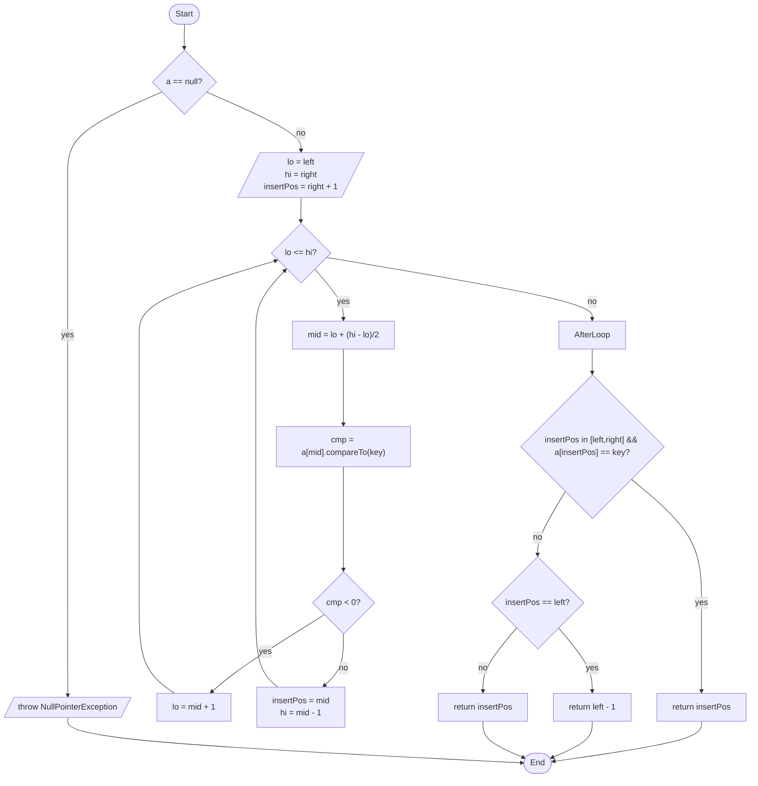

# algo-abgaben

Hier sind die Lösungen zu meinen Übungsaufgaben zu
Algorithmen und Datenstrukturen.

Dieses repo ist quasi privat, wird nicht aktiv gepflegt.
Wenn jemand den Code mag, kann man ihn gern unter der LICENSE verweden.

Keine Garantie, keine Haftung, keine Doku.

